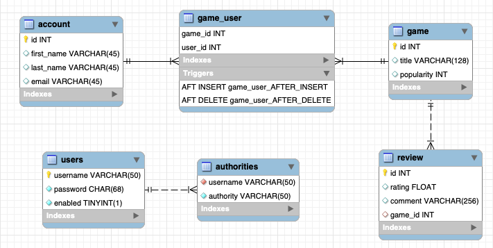

# GameTodoey-Backend
## Summary  
backend server program for collecting data from GameTodoey and providing data for [GameTodoey](https://github.com/JaeguKim/GameTodoey) iOS app.  
## System Architecture 
  

## ER Diagram  
  
  
  
## Main Function  
* CRUD User's data  
* CRUD Game's data  
* CRUD Review's data  
* CRUD Game_User's data  
* Login/Logout

## API Documentation
[Swagger Hub Link](https://app.swaggerhub.com/apis-docs/JaeguKim/GameTodoey-Admin-API/0.0.1)  
  
## Sample Webpage  
  
  
## Version of tools  
* Spring Framework - 5.0.6.RELEASE  
* Hibernate - 5.4.1 Final  
* MySQL - 5.1.45  
* C3PO - 0.9.5.2  
* MAVEN - 1.8  
* JAVA - 1.8  
* Spring Security - 5.0.3.RELEASE
